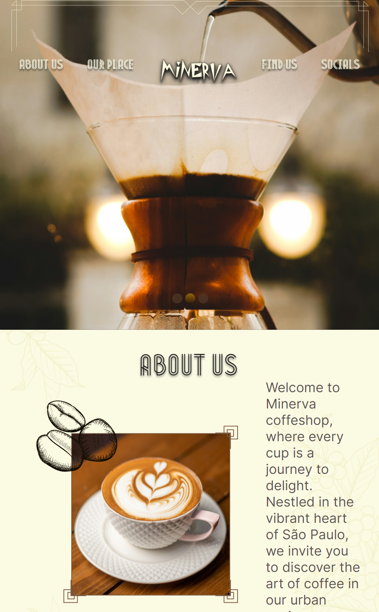

# Minerva Coffee Shop



Minerva Coffee Shop is a React-based web application for showcasing a coffee shop's products and services. It utilizes the latest technologies such as React 18.2, Vite 5.2, and Swiper 11.1 to provide a modern and responsive user experience.

## Table of Contents

- [Features](#features)
- [Demo](#demo)
- [Installation](#installation)
- [Usage](#usage)
- [Technologies Used](#technologies-used)
- [Contributing](#contributing)
- [License](#license)

## Features

- Responsive design for seamless browsing on all devices.
- Interactive carousels powered by Swiper 11.1.
- Fast development and hot module replacement with Vite 5.2.
- Modern and intuitive user interface inspired by the Figma design.

## Demo

[View Demo](https://renatomore.github.io/minerva-coffee-shop/)

## Installation

To install and run Minerva Coffee Shop locally, follow these steps:

1. Clone the repository:

   ```bash
   git clone <repository-url>
   ```

2. Navigate to the project directory:

   ```bash
   cd minerva-coffee-shop
   ```

3. Install dependencies:

   ```bash
   npm install
   ```

## Usage

To start the development server, run the following command:

```bash
npm start
```

This will start the application on [http://localhost:3000](http://localhost:3000).

## Technologies Used

- React 18.2
- Vite 5.2
- Swiper 11.1
- Figma (Design Inspiration)

## Contributing

Contributions are welcome! Please fork the repository and submit a pull request with your proposed changes.

## License

This project is licensed under the [MIT License](https://opensource.org/licenses/MIT).
